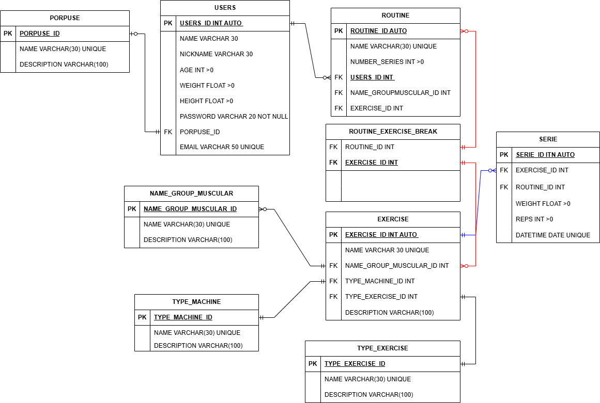

<h1>
GYM-PROGRESS
</h1>

<h3>
description:
</h3>

the  project is a software to save the progress( in the reps and weights in the routines), also we can find justifications to use step 10 ontology in mysql and the advantages of the design-patterns.

<h3>
M.E.R.</h3>
